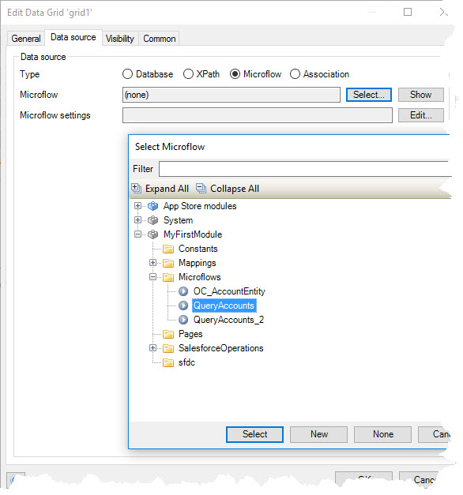
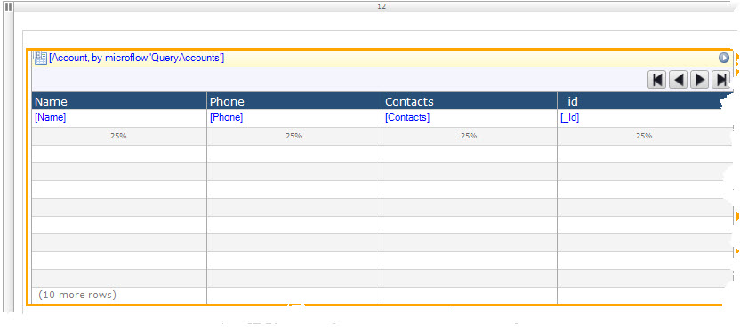
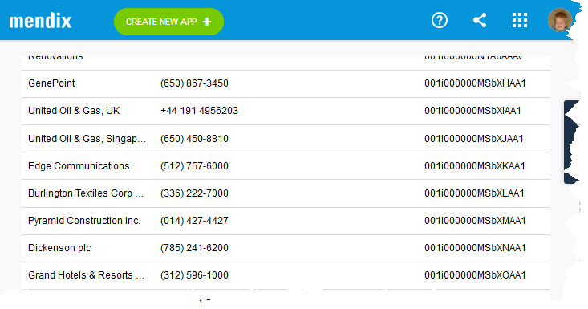

| [ <--- Back to main ReadMe](README.md) | _____________________________ | [ Next Step (Contacts View by Account) ---> ](ContactsView.md) |
|:---------------------------------------|:------------------------------|:---------------------------------------------------------------|
# Accounts List View -- the "Master" view of Master-Detail

1. Initial Accounts DataGrid(#create-datagrid)
   * Create initial DataGrid to display _SFDC Accounts_
   * Select Query Accounts microservice for the DataGrid  
     
   - DataGrid should look like the following

        

   <!-- * [Run the Mendix model and it should show something similar to](#accounts-datagrid-running) -->
   * Run the Mendix model and it should show something similar to  
     
> Congratulations... you have successfully created the initial
> Salesforce Accounts List.
>
> Later, I will remove some of the displayed columns to show a better
> use of UI screen space

_ _ _

| [ <--- Back to main ReadMe](README.md) | __________________________ | [Next Step (Contacts View by Account) ---> ](ContactsView.md) |
|:---------------------------------------|:---------------------------|:--------------------------------------------------------------|

<!--

### Accounts Create DataGrid

     )

 -->

<!--
Contacts_DataGrid_Assign_Grid_Name.jpg Contacts_DataGrid_DataSource.jpg
Contacts_DataView_Wrapper.jpg

Page_Grid_Container_Assign_Width Page_Grid_Container_Add
Page_Grid_Container_Layout Query_Contacts_By_Account

Contacts_DataGrid_Assign_DataSource Contacts_DataGrid_Assign_Grid_Name
Contacts_DataGrid_DataSource
-->