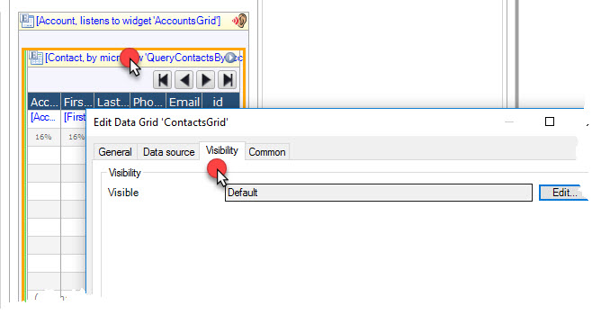
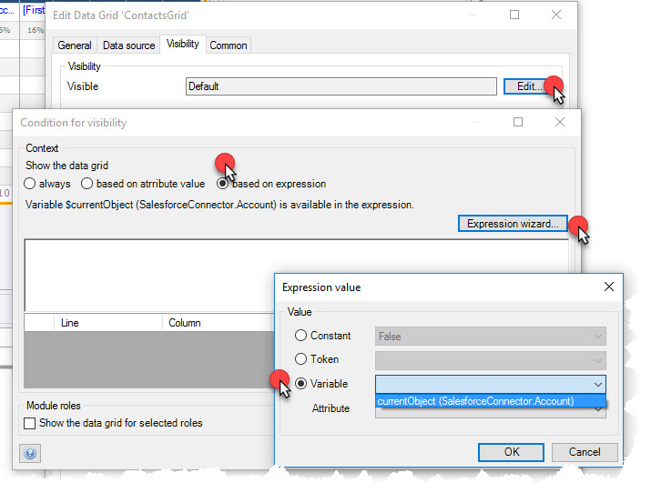
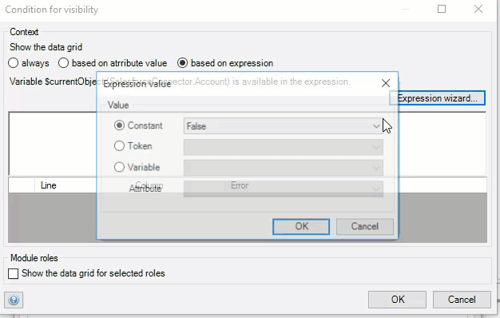
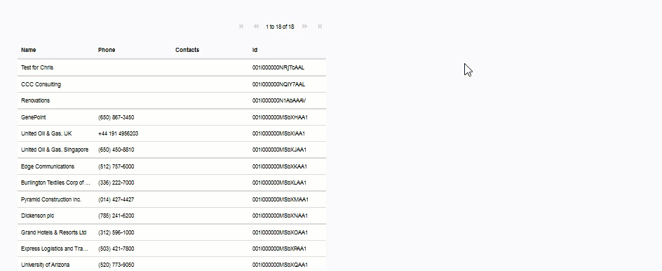
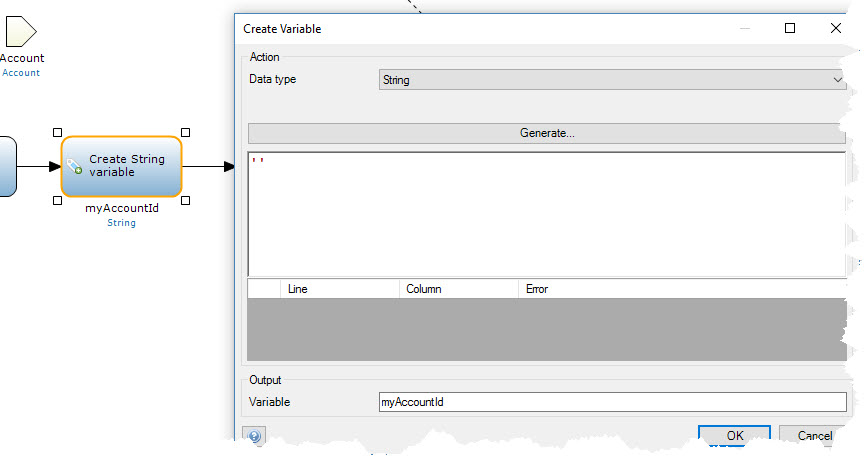
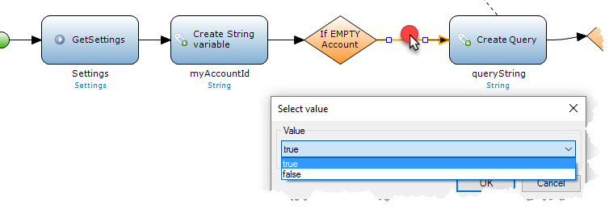
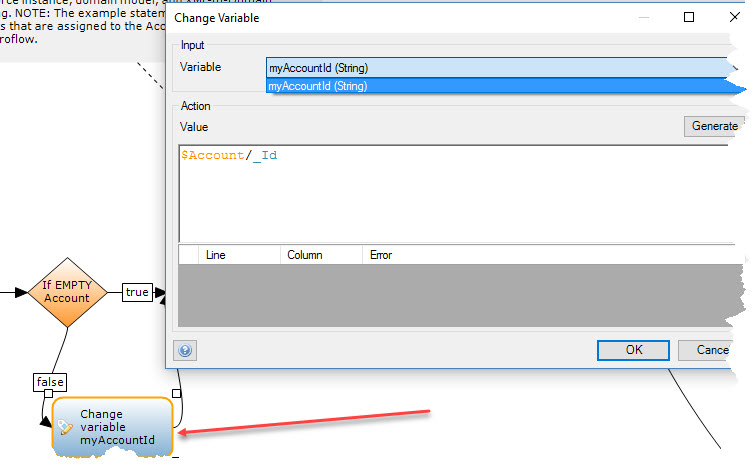
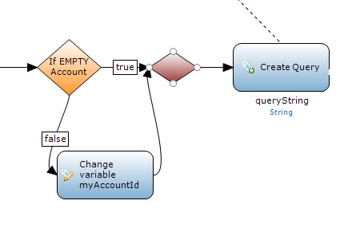

| [ <--- Back to main ReadMe](README.md) | _____________________________ | [ <--- Previous Step (Contacts View by Account) ](ContactsView.md) |
|:---------------------------------------|:------------------------------|:-------------------------------------------------------------------|
# Avoiding Errors for empty/null values in Microservices

## There are two obvious ways to avoid issues executing a microservice that has a dependency for an input parameter.
1. Avoid rendering/displaying the specific 'view' if the object does not exist
2. Create a step in the flow to test whether the microservice call has
   the required input object or value

   * Test condition **[Input Parameter]**:
        - EXISTS    -- Pass on existing parameter
        - NOT EXIST -- Create/Set an entity based object but have the values be blank or default value

### Visibility Rule -- Avoid rendering the data 'view'
* Double-click the header of the **_ContactsGrid_**
    * Click on the **Visibility** tab

  <a href="./images/Visibility/DataGrid_DC_Visibility.jpg"></a>

* Click **Edit**
    - Click **"based on expression"**
    - Click **"Expression Wizard"**
    - Click **"Variable"**
    - Select **"Current Object"**
    - Click **OK**

    <a href="./images/Visibility/DataGrid_DC_Visibility_Expression.jpg"></a>
* Complete the **_Expression Wizard_** by adding **_"!= empty"_**

<a
href="./images/Visibility/DataGrid_DC_Visibility_NOT_EMPTY_Anim.gif"></a>

###  Here is the result of setting the Visibility on the **_ContactsGrid_** datagrid
> Note: This is my sample data for my Salesforce account. Your data will
> be different.
>
> The section on the right is where the Visibility is being set. When a
> row is clicked, the **Visibility** is **true**

 <a
 href="./images/Visibility/Running_DataGrid_DC_Visibility_Anim.gif"></a>

___
___

### Microservice Catch --
>
> Note: In my project I moved the **SalesforceOperations** to the
> default folder **_MyFirstModule_**
>
> I chose to **duplicate** my **_QueryContactsByAccount_** microservice  and rename it to **_QueryContactsByAccount_**

* Open this new microservice and add a **Create Variable** on the flow after
**Get Settings**  I chose to enter two single quotes for default.   you could also enter some other default or pre-defined value
<a
 href="./images/Microservice_Catch/Microservice_Create_MyAccountId_Variable.jpg"></a>
* Add an **Exclusive Split** after the **Create Variable** "myAccountId "
* Double click the Exclusive Split set the following:
* Caption:  
``` If EMPTY Account```
* The Expression definition is simply checking for an "empty" object or
  an "empty" _Id value:  
  ```$Account = empty or $Account/_Id = empty```
* After the conditional expression is defined, click OK
* Double click the flow connector to the **Create Query** variable and set to ```true```  
<a
 href="./images/Microservice_Catch/Microservice_ExclusiveSplit_True_Flow.jpg"></a>
* Add a **Change Variable**  and connect a flow from the** Exclusive Split** to the Change **Variable**
* Double click the flow and set it to the ```false``` condition
* Double click the **Change Variable** and set to:  
<a
 href="./images/Microservice_Catch/Microservice_ExclusiveSplit_False_Change_Variable.jpg"></a>
* Add a **Merge** and place between the **Exclusive Split** and the **Create Query**
* Connect the **Change Variable** and the **Merge**  
 <a
   href="./images/Microservice_Catch/Microservice_ExclusiveSplit_Merge_Flow.jpg"></a>
>
> The previous step is simply testing for existance of the Account object.
>   If there is a view that is dependant on this microservice on initial page rendering, the object
> will likely not exist.  This will test for that condition, and set an appropriate value and continue running the rest of the flow, thus avoiding unnecessary errors

___

| [ <-- Back to main ReadMe](README.md) | __________________________ |   |
|:--------------------------------------|:---------------------------|:--|
