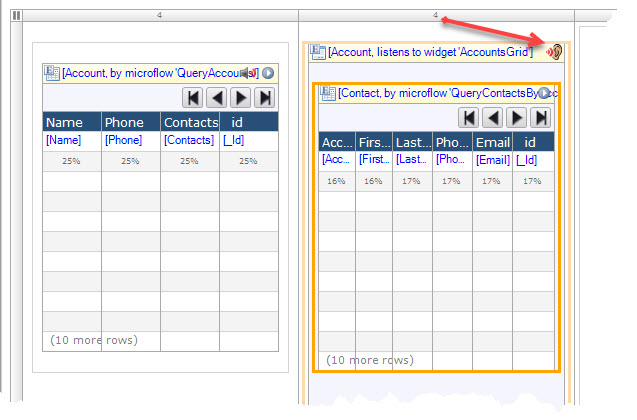

| [ <--- Back to main ReadMe](README.md) | _____________________________ | [ <--- Previous Step (Accounts List) ](AccountsList.md) |
|:---------------------------------------|:------------------------------|:--------------------------------------------------------|
# Contacts View -- the Detail view of Master-Detail

### Create a DataGrid inside a DataView to display Contacts of Account
##### Now we need another DataGrid to display _SFDC Contacts_ that responds to the clicked row from _SFDC Accounts_. In order to do this we first need to create a DataView that is associated with the _Account_   entity.

   * Right-click on the Container and "Add Column Right" (Optional --
     repeat this to add a third column)

     

   * Configure columns for a 4-4-4 grid space (this is just an example
     layout for screen real estate - 3 even columns)  
       
        -The Container view should look something like the following:  
           

* Select DataView and place it on the page in the second column. Give it
  a Common Name of "ContactsDataView"
    -  Set the _Data source_ of the _**ContactsDataView**_ to List widget:
       Data grid '**AccountsGrid**'  
  
        Association to Account (do not auto-populate the fields)

* Add a DataGrid inside the _**ContactsDataView**_ and give it a name
  "ContactsGrid"

  

* Assign the Data Source to reference List Widget --> Data grid 'AccountsGrid'
  * reference List Widget --> Data grid 'AccountsGrid'  
    
  * If you did not hit OK on the previous step your DataGrid will look like the following showing a name of ***grid1***  
      

* Select ***Yes*** to the Auto-Populate option to fill in the default fields of the Contact  
     

* The Mendix Designer view should look something like the following:  
    
* Run Locally (or wherever you choose to run it)

    >Results will vary depending on the ***Salesforce*** data you have available.  
    >The data I am referencing was imported as a sample dataset into ***Salesforce***.
    >
    >**NOT ALL ACCOUNT HAVE CONTACTS in my data** -- that is the reason for the
    >initial error.
    >
    > If your data is more complete and have Contacts for all Accounts, then you will not see this error
    >

    - Running with my data I see the following  
        

    - Clicking OK on the error  
        

    - Clicking on another ***Account*** row  
        
  - A quick screenshot of it running  
    

> **So far all the inputs and configurations have been primarily using the
> default settings with the obvious exception of giving a name to a Widget.**
>
 >There are a couple obvious and reasonably simple steps to further configure our services and UI
>1. Gracefully handle empty or null input values for microservices
>    - configure visibility of the DataGrid based on an ***expression value***  
>       **OR**
>    - Extend the microservice to be more flexible on running with a null input parameter
>
>2. Modify the data / columns being display to make better use of screen real estate
>
___

| [ <--- Back to main ReadMe](README.md) | __________________________ | [Next Step (Avoiding Errors for empty parameters) --->](AvoidErrorForEmptyValue.md) |
|:---------------------------------------|:---------------------------|:-----------------------------------------------------------------------------------|
