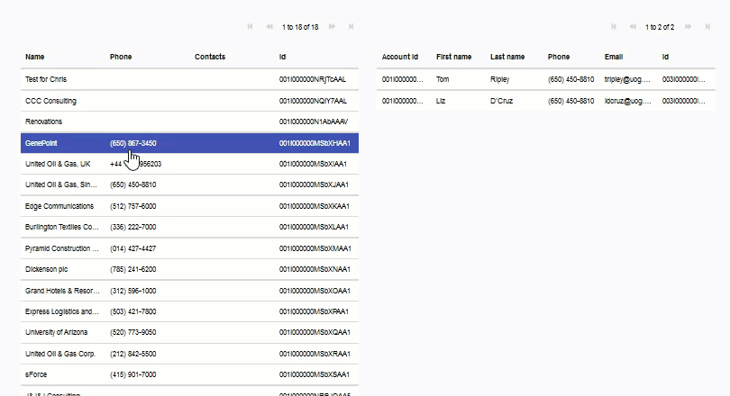
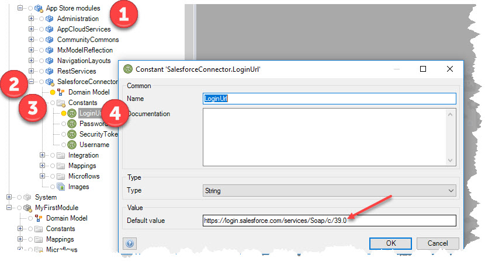
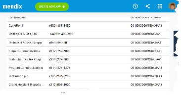
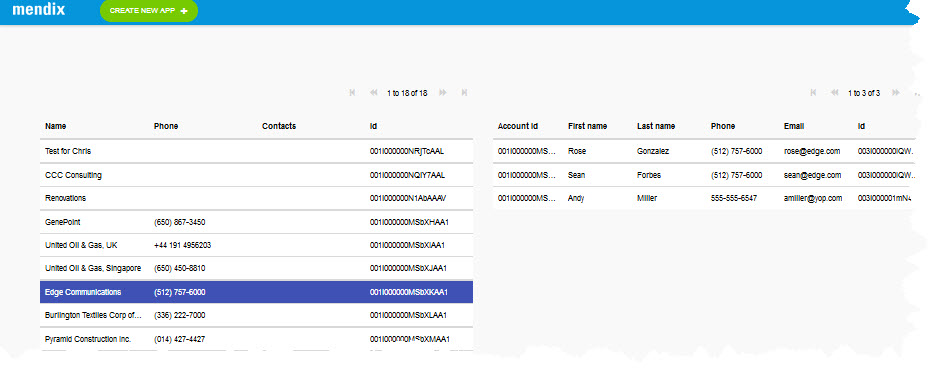
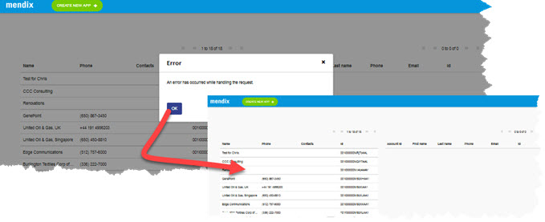

# Salesforce Master-Detail using Mendix

Using **Mendix Modeler** to develop an integration with **Salesforce** to
display a _Master-Detail_ click action on the same page.

Let me start by stating that I am a new to **Mendix** development. I am
not new to Rapid Development technologies, so I  
do understand the value and fundamentals of "low code" type of
solutions.
> ### This is a **work in progress** and I am making updates often
>
>

## Goals of my exercise:

My initial challenge was to create an integration into Salesforce. I
wanted to create a Master-Detail view so that I could click on an
***Account*** row and get ***Account Contacts*** dynamically on the same
page.
>Bottom line: Create a **Master-Detail** page with the data visible on
>the same page and not going to a new **Detail** page.

### Follow the following high level steps to configure:
### [1. Create initial **_Salesforce_** integration](SalesforceSetup.md)
   - Get SFDC credentials
   - Configure _**Constants**_ in Mendix reflecting security and URL  
   
### [2.   Salesforce Accounts List](AccountsList.md)
   - This step will result is something similar to:  
    
### [3.   Contacts View by Account](ContactsView.md)

### [4.  Avoiding Errors for empty values](AvoidErrorForEmptyValue.md)

> ### Please feel free to share comments or issues. @mpgeiger
