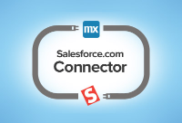
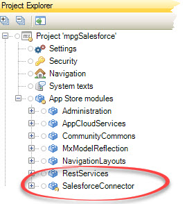
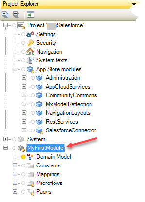
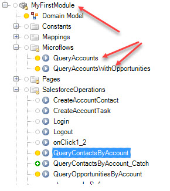

| [ <-- Back to main ReadMe](README.md) | _____________________________ | [ Next Step (Accounts List) ---> ](AccountsList.md) |
|:--------------------------------------|:------------------------------|:----------------------------------------------------|
# Initial Salesforce Setup

Refer to the **Mendix App Store** to download the ***Salesforce Connector*** and get more detailed information  

___
## This is not intended a complete tutorial on the Salesforce integration and package from the [App Store](https://appstore.home.mendix.com/link/app/1424/)

1. Open the Mendix Modeler and go to the AppStore (link on the top right of the Modeler)
2. Search for and install
    - Salesforce Connector
    - Rest Services (not necessary initially for this example, but I do it as a Best Practice)
3. Verify the installation by opening the "Project" tree on the top left of the modeler.
    It should look similar to the following:  
        
4. Expand the **_SalesforceConnector_** view --> **_Constants_** Fill
   in:  
   \- LoginUrl  
   \- Password  
   \- Security Token (this token is generated from Salesforce)  
   \- Username  
   

5. In my project, I started with a default Mendix starter project. This
   created an initial project with the default naming conventions,
   folders and project hierarchy.

   For the scenario of this workign example, I did not rename my
   "project folder", therefore the application portions of my project
   will be in **MyFirstModule**. In general, one would typically rename
   this to something appropriate like "SalesforceMasterDetail" or
   similarly clever.  
   

6.  Optional -- I chose to do to keep my work separate from the
    out-of-the-box components that were defined by the
    _SalesforceConnector_. **This is my personal opinion. I am not sure
    if this would be a Mendix best practice.** The following is a
    summary of my minor modifications to the default project and
    SalesforceConnector install.
    - I chose to move the SalesforceOperations to "MyFirstModule"
    folder.
    - I chose to create a Microflows folder with what were initially
      "duplicates" of the original out-of-the-box (OOB) microservices.
      To create a duplicate of something in the Mendix Modeler, simply
      right-click the item and "duplicate"  
    

<!--
> **So far all the inputs and configurations have been primarily using the
> default settings with the obvious exception of giving a name to a Widget.**
>
 >There are a couple obvious and reasonably simple steps to further configure our services and UI
>1. Gracefully handle empty or null input values for microservices
>    - configure visibility of the DataGrid based on an ***expression value***  
>       **OR**
>    - Extend the microservice to be more flexible on running with a null input parameter
>
>2. Modify the data / columns being display to make better use of screen real estate
>
___ -->

| [ <-- Back to main ReadMe](README.md) | __________________________ | [Next Step (Accounts List) --> ](AccountsList.md) |
|:--------------------------------------|:---------------------------|:--------------------------------------------------|
